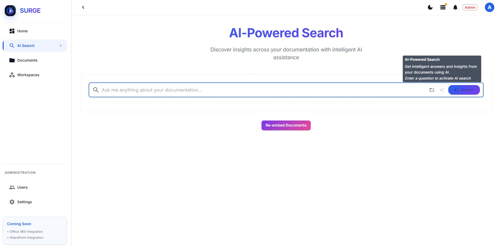
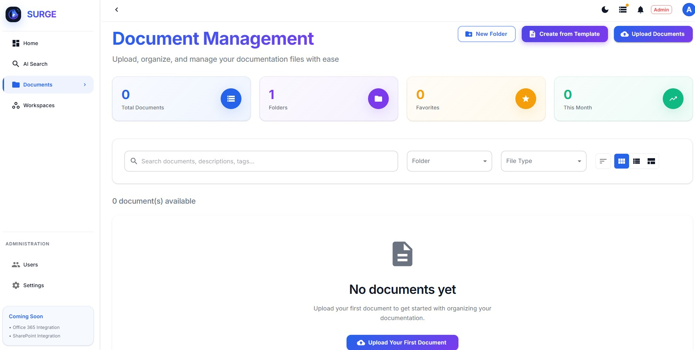
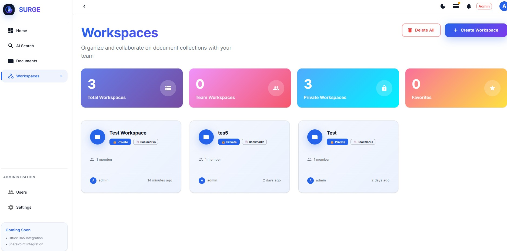
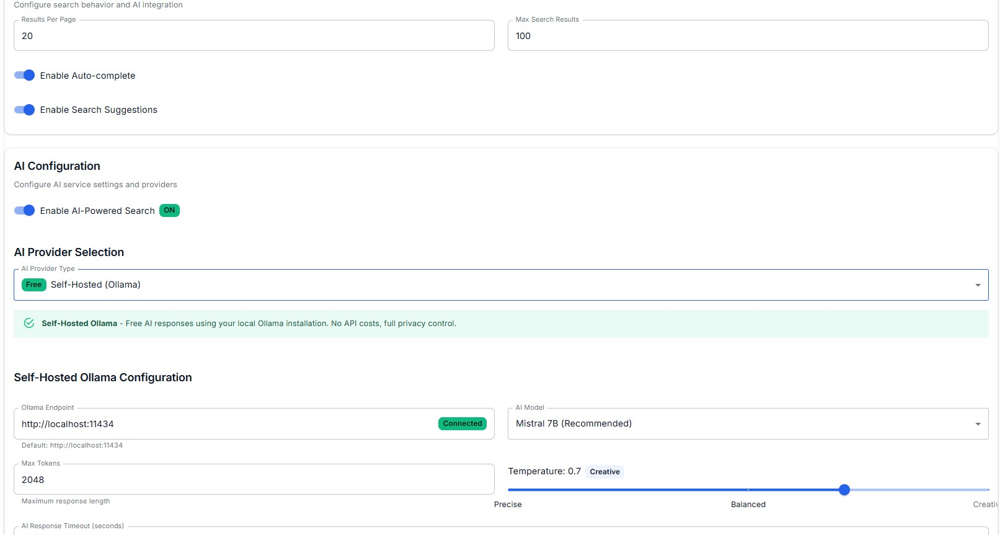
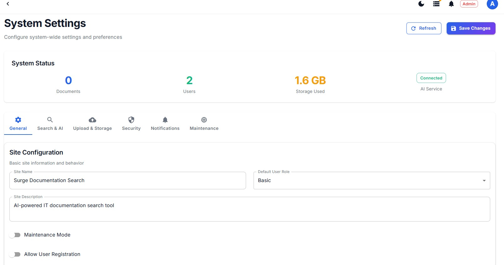
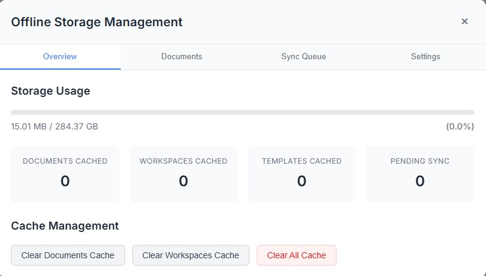

# Welcome to Surge: The Enterprise Documentation Platform

  

  <strong>An enterprise-grade documentation platform designed for IT professionals and teams, combining powerful AI-driven search with advanced collaboration tools to create, manage, and discover your organisation's knowledge base.</strong>

  <a href="https://bitsurge.io"><strong>Website</strong></a> · <a href="https://demo.bitsurge.io"><strong>Live Demo</strong></a>

---

## Key Features & Benefits

Surge is more than just a document search tool; it's a comprehensive platform built for the modern enterprise.

🚀 Advanced Collaboration

- **Real-time Collaborative Editing**: Work together seamlessly with live cursors and document locking.
- **Comprehensive Commenting System**: Engage in discussions with threading, mentions, and reactions.
- **Document Review Workflows**: Streamline approvals with structured review processes.
- **Version Control**: Track every change with a complete history and visual difference comparisons.

  

🏢 Enterprise Workspace Management

- **Multi-Workspace Organisation**: Structure your knowledge with role-based permissions.
- **Team Collaboration Features**: Enhance teamwork with flexible access controls.
- **Workspace Analytics**: Gain insights into team productivity and engagement.
- **Custom Branding**: Adapt the platform to your company's brand identity.

  

🤖 AI-Powered Intelligence

- **Intelligent Search**: Find what you need instantly with natural language queries.
- **Content Suggestions**: Discover relevant information with AI-powered analysis.
- **Automated Document Processing**: Save time with automatic text extraction and OCR.
- **Smart Recommendations**: Get suggestions based on your usage patterns.

  

🔒 Robust Security & Administration

- **Advanced Authentication**: Integrate with SSO and LDAP for secure access.
- **Granular Permissions**: Control access at both workspace and document levels.
- **Audit Logging**: Maintain compliance and monitor security events.
- **Secure Document Vault**: Protect sensitive information in a secure environment.

  

📱 Modern & Accessible Experience

- **Responsive Design**: Access your documentation on any device.
- **Progressive Web App (PWA)**: Work offline with our PWA capabilities.
- **Mobile-Optimised Interface**: Stay productive on the go.
- **Rich-Text Editor**: Create dynamic content with support for diagrams, equations, and multimedia.

  

---

## Documentation Overview

Our documentation is organised to serve different audiences and use cases.

| For End Users | For Administrators | For Developers |
| --- | --- | --- |
| **[Getting Started](./docs/user-guide/getting-started.md)** | **[Installation Guide](./docs/admin-guide/installation.md)** | **[REST API Reference](./docs/api/README.md)** |
| **[Workspaces](./docs/user-guide/workspaces.md)** | **[User Management](./docs/admin-guide/user-management.md)** | **[Webhook Config](./docs/api/webhooks.md)** |
| **[Collaboration](./docs/user-guide/collaboration.md)** | **[Security Config](./docs/admin-guide/security.md)** | **[Custom Templates](./docs/customization/templates.md)**|
| **[Search & Discovery](./docs/user-guide/search.md)** | **[Backup & Recovery](./docs/admin-guide/backup.md)** | **[Branding](./docs/customization/branding.md)** |
| **[Templates](./docs/user-guide/templates.md)** | | |

---

## Getting Help

- **New to Surge?** Start with our [Getting Started Guide](./docs/user-guide/getting-started.md).
- **Need admin help?** Check the [Administrator Guide](./docs/admin-guide/README.md).
- **Developer resources?** Visit our [API Documentation](./docs/api/README.md).
- **Having issues?** See our [Troubleshooting Guide](./docs/troubleshooting/common-issues.md).

---

  <strong>Version:</strong> Latest | <strong>Last Updated:</strong> August 2025 | <strong>Platform:</strong> Surge Enterprise Documentation Platform

